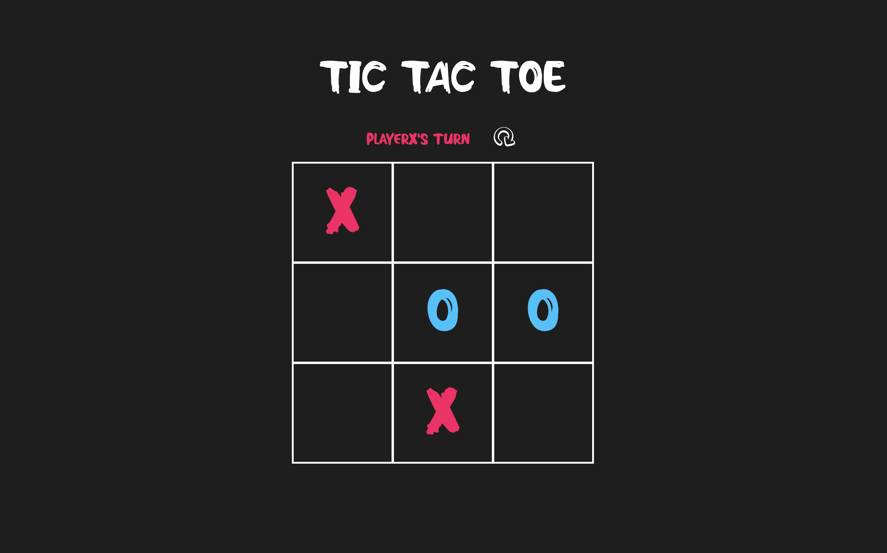

# tic-tac-toe

#### Check the live demo here -> https://amormio25.github.io/tic-tac-toe/

## Features 
- Interactive game board with real-time feedback and clear win/draw detection
- Game state updates dynamically with each move, allowing real-time feedback to players
- Organized code structure designed around modular patterns, encapsulation, and IIFEs.

## Acknowledgements
- Project by The Odin Project
- Inspired by project submissions to The Odin Project